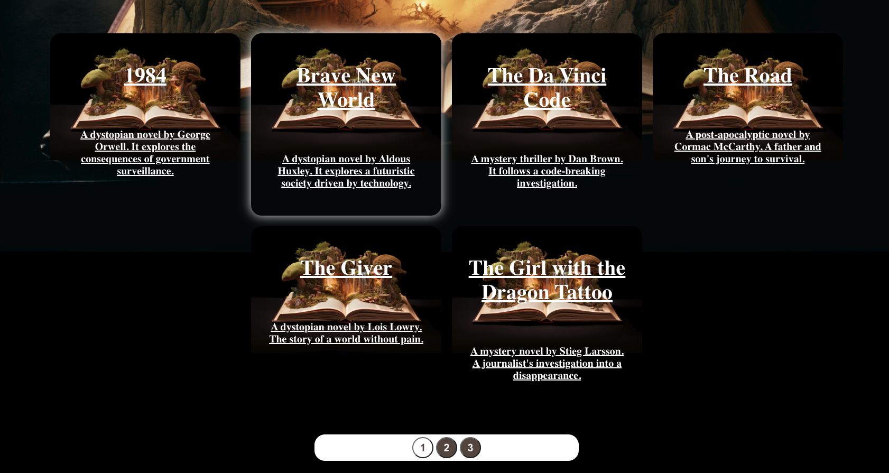
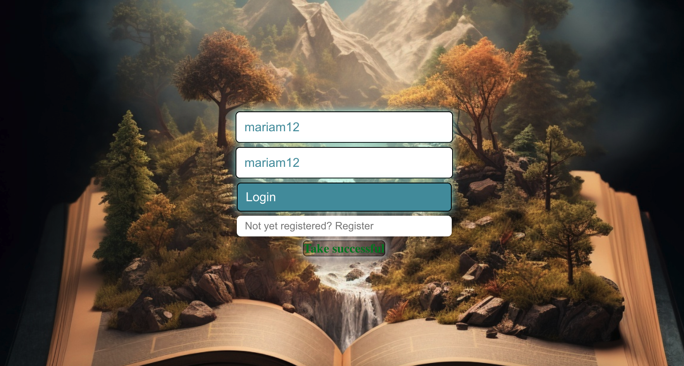

## Library Kiosk Front-End Application

Welcome to the Library Kiosk Front-End Application repository! This project is a self-service kiosk web application designed to facilitate book borrowing and returning in a library.

### Table of Contents

1. [Introduction](#introduction)
2. [Features](#features)
3. [Technical Stack](#technical-stack)
4. [Getting Started](#getting-started)
5. [Folder Structure](#folder-structure)
6. [Screenshots](#screenshots)
7. [Contributing](#contributing)

### Screenshots


_Landing Page_


_Borrow Books _


_Categories _


_Return Books _


_Takes Books _


_Registration _

### Introduction

This front-end application is built using TypeScript and React, with a focus on creating a user-friendly interface for a self-service kiosk in a library. The application allows users to borrow and return books through an intuitive and seamless process.

### Features

#### Main Services Page

- Visually appealing landing page.
- Two primary services: Borrow a Book and Return a Book.

#### Borrow a Book Wizard

1. **Book Categories Page:**

   - Fetch and display book categories from the mock backend.
   - Categories with an intuitive UI for selection.

2. **Book Selection Page:**

   - Fetch and display books based on the selected category.
   - Pageable list of books with the ability to select a book for borrowing.

3. **User Authentication:**

   - Login form for users to input their library username and password.
   - Authentication username and password with the backend.
   - Display appropriate messages upon successful/unsuccessful authentication.

4. **Borrow Confirmation:**
   - Confirmation message for successful book borrowing.
   - Appropriate message in case of errors or failures.
   - After successfully authenticating the user and displaying the confirmation message for borrowing a book, an additional step is taken to update the server and mark the book as borrowed.

### Borrow Confirmation Process

1. **User Authentication**: The user is authenticated using their library username and password.

2. **Borrow Confirmation**: Once authenticated, a confirmation message is displayed to the user, indicating that the book has been successfully borrowed.

3. **Server Update**: Simultaneously, a request is sent to the server to update the borrowing status.

4. **Handling Responses**:
   - If the server responds with success, a success message is logged, indicating that the borrow confirmation was successful.
   - If the server returns an error, an error message is logged, and the user is notified that the borrow confirmation failed.

#### Return a Book Wizard

1. **Book ID Entry:**

   - Simple form to input the book's ID.

2. **User Authentication:**

   - Authentication of the user using library username and password.

3. **Return Confirmation:**
   - Confirmation message for successful book return.
   - Appropriate message in case of errors or failures.

### Return Confirmation Process

1. **User Input**: Users input the book's ID, library username, and password.

2. **Server Check**: A request is sent to the server to verify the user's credentials and check the book's status.

3. **Handling Responses**:
   - If the server responds with success and the book ID is found in the user's borrowed books, a success message is displayed, indicating a successful book return.
   - If the server returns an error due to invalid credentials, an error message for incorrect username or password is shown.
   - If the book ID is valid but not found in the user's borrowed books, an error message for the incorrect book ID is displayed.

### Technical Stack

- TypeScript
- React
- React Hooks
- REST API
- CSS (Styled Components for styling)

### Getting Started

To run the application locally, follow these steps:

1. Clone the repository:

```bash
git clone https://github.com/mariamlag/library-kiosk.git
```

2. Install dependencies:

```bash
cd library-kiosk-project
npm install
```

3. Run the application:

```bash
npm run dev
```

4. Run JsonServer

```shell
npx json-server --watch data.json --port 3032
```

### Contributing

Contributions are welcome! Feel free to submit issues or pull requests.
